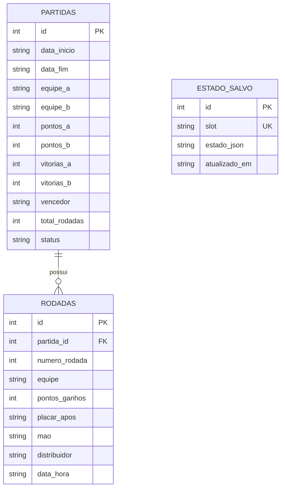

# Arquitetura do Software — Contador de Truco (AED1)

Este documento descreve as camadas arquiteturais, o fluxo de dados entre os TADs, as interfaces de usuário e a **Camada de Persistência & Banco de Dados**.

---

## 1. Visão Geral das Camadas

```
+-------------------------------------------------------------+
|                     CAMADA DE APRESENTAÇÃO                   |
|   - Interface Web (HTML5 / Vanilla CSS Glassmorphism / JS)   |
|   - Interface de Terminal Interativa (Python CLI com BD)    |
+-------------------------------------------------------------+
                               |
                               v
+-------------------------------------------------------------+
|                     CAMADA DE ORQUESTRAÇÃO                  |
|   - TADPartida: Controle de fluxo, snapshots, turnos e serial|
|   - RegrasTruco: Validação de apostas, Mão de 11 e Ferro    |
+-------------------------------------------------------------+
                               |
            +------------------+------------------+
            |                                     |
            v                                     v
+-----------------------------+     +-----------------------------+
|     CAMADA DE TADs (AED1)   |     |    CAMADA DE PERSISTÊNCIA   |
| - TADPlacar: Pontos/Quedas  |     | [Python]:                   |
| - TADListaEncadeada: Mãos   |     |  - DatabaseManager (SQLite) |
| - TADPilha: Undo/Redo       |     |  - RepositorioPartida (CRUD)|
| - TADFilaCircular: Mesa     |     | [Web]:                      |
|                             |     |  - StorageManager (Storage) |
+-----------------------------+     +-----------------------------+
```

---

## 2. Esquema Relacional do Banco de Dados (SQLite & Web)

O sistema possui modelagem relacional normalizada:



### Detalhamento das Entidades:
1. **`partidas`**: Armazena o registro mestre de cada jogo disputado (resultado, pontuação final, data/hora e vencedor).
2. **`rodadas`**: Trilha de auditoria detalhada de cada mão jogada (ligada ao `TADListaEncadeada`), associada à partida via chave estrangeira (`FOREIGN KEY ... ON DELETE CASCADE`).
3. **`estado_salvo`**: Armazena snapshots serializados em JSON de todos os TADs de uma partida em andamento (Pilha, Fila, Lista e Placar) para permitir pausar e retomar jogos.

---

## 3. Fluxo de Dados com Persistência

1. **Pontuação e Registro**:
   - Usuário pontua (`+1`, `+3`, `+6`, `+9`, `+12`).
   - `TADPartida` atualiza `TADPlacar`, empilha no `TADPilha (Undo)`, insere no `TADListaEncadeada` e rotaciona `TADFilaCircular`.
   - O estado ativo é automaticamente salvo no banco local (Storage/SQLite).
2. **Finalização de Partida (12 tentos)**:
   - Ao detectar vencedor, a partida é inserida na tabela `partidas`.
   - Todas as rodadas armazenadas no `TADListaEncadeada` são inseridas em lote na tabela `rodadas`.
3. **Desfazer / Refazer (Undo/Redo)**:
   - Utiliza a semântica estrita LIFO da `TADPilha` sem afetar a consistência do banco de histórico.
